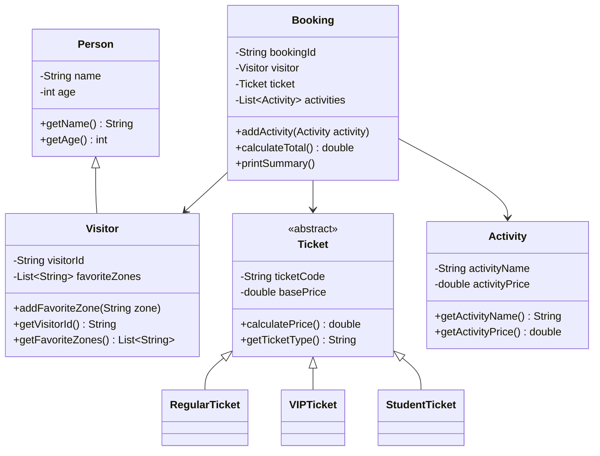

# Sistem Manajemen Aquarium Singapura

## Deskripsi Kasus

Pada tugas ini, saya membuat sebuah program berbasis Object-Oriented Programming (OOP) yang mensimulasikan sistem pengelolaan kunjungan di sebuah aquarium, yaitu Aquarium Singapura.

Program ini dirancang untuk menangani proses sederhana seperti:

* input data pengunjung,
* pemilihan jenis tiket,
* penentuan zona favorit,
* penambahan aktivitas tambahan,
* serta perhitungan total biaya yang harus dibayar.

Ide dari program ini terinspirasi dari pengalaman berkunjung ke tempat wisata modern yang biasanya menyediakan berbagai jenis layanan tambahan selain tiket masuk.

Dengan sistem ini, pengguna dapat melakukan input langsung melalui console sehingga program menjadi lebih interaktif dan tidak statis.

---

## Keunikan Program

Program ini memiliki beberapa keunikan yang membedakannya dari program lain, antara lain:

* Program menggunakan input langsung dari user (tidak menggunakan data tetap/hardcoded)
* Pengunjung bisa menentukan sendiri zona favorit yang ingin dikunjungi
* Tersedia fitur aktivitas tambahan dengan harga yang bisa disesuaikan
* Perhitungan harga tiket berbeda tergantung jenis tiket (VIP, Student, dll)
* Output menampilkan ringkasan lengkap seperti sistem booking sederhana

Menurut saya, bagian aktivitas tambahan ini cukup menarik karena membuat program terasa lebih realistis dibanding hanya sekadar sistem tiket biasa.

---

## Class Diagram



---

## Kode Program Java

Kode program lengkap dapat dilihat pada file berikut:

```
Main.java
```

Program ini menggunakan konsep input dari user sehingga saat dijalankan, pengguna akan diminta mengisi beberapa data seperti nama, umur, jenis tiket, dan aktivitas tambahan.

---

## Screenshot Output

Berikut adalah contoh hasil output saat program dijalankan:


---

## Penjelasan Prinsip OOP

### 1. Encapsulation

Encapsulation diterapkan dengan cara menyimpan data dalam atribut yang bersifat private.

Contohnya pada class `Person`:

* name
* age

Data tersebut tidak bisa diakses langsung, tetapi melalui method seperti `getName()` dan `getAge()`.

Hal ini membuat data lebih aman dan tidak mudah diubah sembarangan dari luar class.

---

### 2. Inheritance

Inheritance digunakan untuk mengurangi pengulangan kode.

Contoh:

* Class `Visitor` merupakan turunan dari `Person`
* Class `RegularTicket`, `VIPTicket`, dan `StudentTicket` merupakan turunan dari `Ticket`

Dengan konsep ini, atribut umum seperti nama dan umur tidak perlu ditulis ulang di setiap class.

---

### 3. Polymorphism

Polymorphism terlihat pada method `calculatePrice()`.

Meskipun method ini ada di class `Ticket`, setiap subclass memiliki implementasi yang berbeda:

* Regular → harga normal
* VIP → harga lebih mahal karena fasilitas tambahan
* Student → mendapatkan diskon

Ini membuat program lebih fleksibel dan mudah dikembangkan.

---

### 4. Abstraction

Abstraction diterapkan pada class `Ticket` yang bersifat abstract.

Class ini hanya memberikan gambaran umum tentang tiket, sedangkan detail perhitungan harga diimplementasikan di masing-masing subclass.

Dengan cara ini, struktur program menjadi lebih rapi dan terorganisir.

---

## Kesimpulan

Dari program ini, dapat disimpulkan bahwa konsep OOP sangat membantu dalam menyusun program yang terstruktur dan mudah dikembangkan.

Dengan menggunakan:

* Encapsulation
* Inheritance
* Polymorphism
* Abstraction

program menjadi lebih modular dan tidak mudah berantakan.

Selain itu, penggunaan input dari user membuat program lebih interaktif dan mendekati kondisi nyata.

---

## Catatan

Program ini masih bisa dikembangkan lebih lanjut, misalnya dengan:

* penambahan sistem membership,
* diskon berdasarkan umur,
* atau penyimpanan data ke file/database.

Namun untuk tahap ini, program sudah cukup untuk menunjukkan penerapan konsep OOP secara lengkap.
